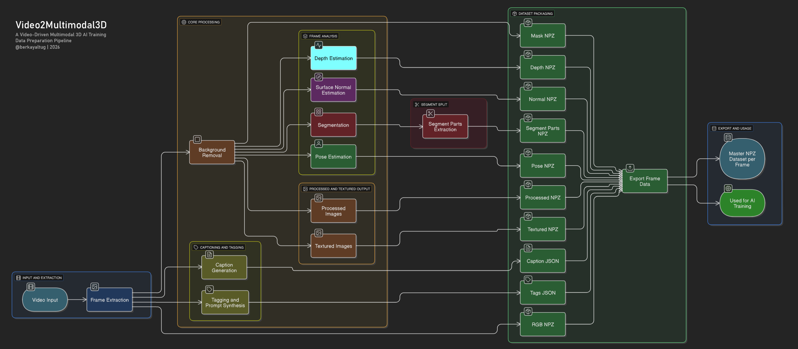
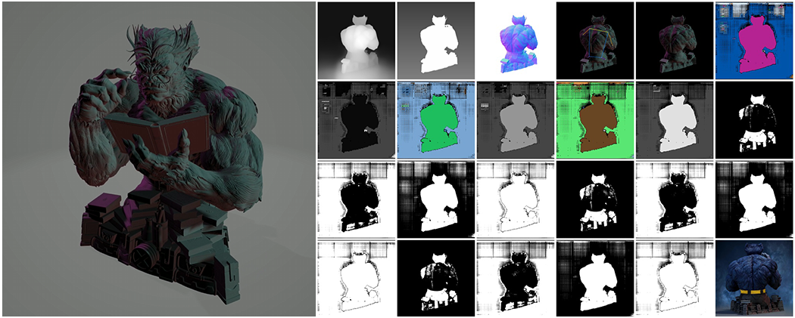

## A Video-Driven Multimodal 3D AI Training Data Preparation Pipeline

### Technical Whitepaper

**Author:** Berkay Altuğ  | Izmir, Türkiye
**Affiliation**: Independent Researcher and Developer
**Status:** Internal technical document / whitepaper draft  
**Contact:** berkay_altug@outlook.com
**Language:** English

---
## Abstract

This document describes a data preparation system designed to transform raw object videos into structured, multi-layer datasets ready for AI training. The pipeline presented here generates RGB images, masks, depth maps, surface normals, segmentation layers, pose keypoint data, automatic captions, automatic tags, processed texture data, and packaged dataset structures from a single 360-degree object video.

The primary objective of the system is to produce high-quality, multimodal, and modular training data for 3D artificial intelligence models. While automating data generation, the pipeline also addresses practical requirements such as quality control, file validation, redundant process skipping, output organization, and pre-training dataset loading tests.

This whitepaper explains in detail the motivation, architecture, workflow, data format, logging approach, quality control strategy, and intended use cases of the system.

---
## 1. Problem Statement

One of the major bottlenecks in modern 3D AI systems is the preparation of high-quality, multimodal training data. Raw visual inputs are not directly suitable for training. Training data must be:

- aligned,
- consistent,
- cleaned,
- multimodal,
- and structurally organized.

A single RGB image or video does not provide sufficient structural information for robust training. Especially for models expected to develop 3D understanding, it is important to provide geometric, segmentation, pose, semantic, and additional visual context layers together.

The Video2Multimodal3D pipeline was developed to address this need by converting a standard object video into a structured dataset suitable for training.

---
## 2. Goals and Design Principles

The pipeline was designed around the following objectives:

### 2.1 Core Goals

- Automatically generate data from 360-degree object videos
- Produce multimodal training data for each frame
- Organize outputs into a training-friendly directory and file structure
- Automatically exclude invalid or incomplete frames
- Keep the system manageable and extensible for a single operator

### 2.2 Design Principles

- Modularity
- Reproducibility
- File-based validation
- Redundant processing avoidance
- Human-readable logging
- Pre-training dataset verifiability
- Extensible data format
- Preservation of visual, geometric, and semantic layers together

---
## 3. System Overview

The pipeline applies a multi-stage data generation chain starting from a video input. Each generated modality is organized around a shared frame identity so that all outputs remain spatially and structurally aligned.

<p align="center">
  
</p>

The core data flow is as follows:

```text
Video
→ Frame extraction
→ RGB cleaning
→ Mask generation
→ Pose estimation
→ Segmentation
→ Depth
→ Surface normal
→ ID map / colored segmentation
→ Caption
→ Tag
→ Textured image processing
→ NPZ / JSON packaging
→ Logging and dataset summary
```

---
## 4. Input and Output Structure

## 4.1 Input Structure

The pipeline operates with the following core inputs:

```text
video_pipeline/
├── input/
│   ├── video.mp4
│   └── textured/
```

### Inputs

- `video.mp4`: the main 360-degree object video
- `textured/`: auxiliary texture reference or texture-based images

---
## 4.2 Output Structure

The pipeline produces outputs organized by modality:

```text
output_layers/
├── rgb/
├── mask/
├── depth/
├── normal_map/
├── pose/
├── pose_json/
├── segments/
├── processed/
├── captions/
├── tags/
├── textured/
└── data/
```

Final dataset structure for each video:

```text
output_layers/data/{video_name}_data/
├── {frame_id}/
│   ├── rgb.npz
│   ├── mask.npz
│   ├── depth.npz
│   ├── normal_map.npz
│   ├── pose.npz
│   ├── segment_parts.npz
│   ├── idmap.npz
│   ├── colored.npz
│   ├── processed.npz
│   ├── caption.json
│   ├── tags.json
│   └── pose.json
└── textured.npz
```

This structure allows each frame to be loaded independently, while texture data is stored only once at the dataset root.

---
## 5. Processing Stages

## 5.1 Frame Extraction

The video is decomposed into frames using an FFmpeg-based approach at configurable time intervals. Frame identifiers are derived from the original video file name. Example:

```text
00001_bust_beast-x-men-marvel_0001
```

This naming convention ensures that all modalities remain aligned around the same sample identity.

### Purpose

- Temporal sampling
- Viewpoint diversity
- Standardized sample identity

---
## 5.2 RGB Generation

After background removal, a cleaned RGB image is generated. RGB serves as the base visual layer for all downstream modules.

### Output

- `output_layers/rgb/{frame_id}_rgb.jpg`
### Note

RGB is one of the earliest generated modalities in the system.

---
## 5.3 Mask Generation

The mask layer represents foreground-background separation, either as a single-channel mask or as a visually enhanced grayscale/degraded background representation.

### Output

- `output_layers/mask/{frame_id}_mask.jpg`
### Function

- foreground/background separation
- auxiliary mask for subsequent modules
- support for normal map and semantic processing

---
## 5.4 Pose Estimation

A YOLO pose model is used to detect keypoint structure on each frame. This stage also functions as a dataset quality filter.

### Generated outputs

- Pose visualization:
    - `output_layers/pose/{frame_id}_pose.jpg`
        
- Pose JSON:
    - `output_layers/pose_json/{frame_id}_pose.json`
    
### Critical Role

In this pipeline, pose data is not just an auxiliary modality; it is also a structural validity filter. Frames that fail to produce pose keypoint data:

- are excluded from certain downstream modules,
- may be removed from the RGB directory,
- are logged for later review.

This prevents samples with incomplete structural information from entering the final dataset.

---
## 5.5 Segmentation

A Segment Anything–based module separates the object into a main segmentation mask and part-level segment masks.

### Generated outputs

- Main segmentation:
    - `{frame_id}_segmentation.jpg`
        
- Part masks:
    - `{frame_id}_seg_0.jpg`, `{frame_id}_seg_1.jpg`, ...

### Packaged output

- `segment_parts.npz`

### Purpose

- part-aware structural learning
- object decomposition
- support for compositional geometry understanding

---
## 5.6 Depth Map Generation

Depth Anything V2 is used to generate a monocular depth map for each frame.

### Output

- `output_layers/depth/{frame_id}_depth.jpg`

### Contribution

- relative geometric information
- surface depth cues
- a useful geometric intermediate representation for 3D learning

---
## 5.7 Surface Normal Map

A StableNormal model predicts a surface normal map from masked input.

### Output

- `output_layers/normal_map/{frame_id}_normal.png`

### Function

- surface orientation
- local geometry
- strong supervisory signal for 3D surface understanding

---
## 5.8 Processed Layers: ID Map and Colored Segmentation

After segmentation, two additional processed outputs are created:

- `segmentation_idmap`
- `segmentation_colored`

These are later packaged as:

- `idmap.npz`
- `colored.npz`

### Function

- segmentation identity representation
- visual and training-oriented segmentation validation
- standardized part separation

<p align="center">
  
</p>

---
## 5.9 Caption Generation

A BLIP large model is used to generate automatic visual descriptions.

### Output

- `output_layers/captions/{frame_id}_caption.json`

Example:

```json
{
  "frame": "00001_bust_beast-x-men-marvel_0001_rgb.jpg",
  "caption": "a muscular creature holding a book"
}
```

### Function

- semantic description
- vision-language alignment
- support text for prompt-based systems

---
## 5.10 Tag Generation and Prompt Synthesis

A WaifuDiffusion-based tagging module extracts image tags. An additional logic layer then structures:

- series
- character
- theme
- tags
- prompt

Example JSON:

```json
{
  "frame": "00001_bust_beast-x-men-marvel_0001_rgb.jpg",
  "series": "X-men, marvel, Original",
  "character": "Beast",
  "theme": "gothic",
  "tags": "1boy, black background, male focus...",
  "prompt": "gothic theme, inspired by X-men, marvel, Original..."
}
```

### Function

- semantic enrichment
- theme-based annotation
- advanced conditioning support for downstream learning

---

## 5.11 Textured Image Processing

Textured images are processed once per dataset rather than once per frame.

### Final output

- `output_layers/data/{video_name}_data/textured.npz`

This design reduces disk duplication and keeps the data structure semantically correct.

---

## 6. NPZ / JSON Packaging Strategy

The pipeline uses a hybrid data organization strategy.

### Stored in NPZ

- RGB
- mask
- depth
- normal
- pose image
- segment parts
- idmap
- colored
- processed layers
- textured

### Stored in JSON

- pose keypoints
- caption
- tags

The rationale is straightforward:

- image and tensor-like data are best stored in NPZ for efficiency and training compatibility,
- semantic and structured annotations are more readable and flexible in JSON.

---

## 7. File Checking and Skip Logic

One of the pipeline’s core features is that each module validates its own output file before processing.

### Logic

- If the output file already exists, the module skips processing.
- No unnecessary recomputation occurs.
- This saves significant time and storage in large dataset generation runs.

This behavior is further controlled by two flags:

### 7.1 `SKIP_IF_EXISTS`

Skips processing if the output file is already present.

### 7.2 `TEST_MODE`

Used during test runs to prevent previously logged or previously deleted frames from being regenerated.

---
## 8. Keypoint-Based Filtering and RGB Cleanup

Frames that fail to produce pose data are treated as structurally weak samples. A dedicated cleanup function is applied:

### cleanup_unmatched_rgb_frames

- scans the RGB directory,
- checks for matching pose JSON files,
- deletes invalid RGB frames,
- writes deleted frame names to a log file.

### Log file

```text
video_pipeline/logs/deleted_rgb_frames.txt
```

### Relation to TEST_MODE

When TEST_MODE is enabled, the `save_rgb` function checks this log file and prevents previously removed frames from being regenerated.

This makes the pipeline deterministic during iterative testing.

---
## 9. Data Loading and Batch Testing

After NPZ dataset generation, a batch data loader is used to verify the generated dataset before training.

### Purpose

- validate the dataset structure,
- detect broken or incomplete NPZ files early,
- confirm that expected keys and modalities are present.

### Features

- automatically identifies the latest `_data` directory inside `output_layers/data/`,
- scans `.npz` files inside each frame directory,
- provides example batch outputs in test mode.

This stage acts as the first bridge between preprocessing and model training.

---
## 10. Logging and Summary Reporting

A summary report is generated at the end of the pipeline.

### Tracked values

- total processing time
- total number of frames
- number of successfully processed frames
- dataset folder sizes inside `output_layers/data/`
- numbered dataset summaries in a log file

Example:

```text
[001] 00001_bust_beast-x-men-marvel_data :
Total: 16 frames, Processed: 12 frames, Duration: 1m 33s - 108 mb - 2025-07-30 14:54:41
```

### Importance

- measures dataset generation efficiency
- compares different video sets
- reveals generation cost
- supports quick pre-training validation

---
## 11. Quality Control Strategy

Quality control in the system operates at four levels:

### 11.1 File Presence Validation

Each module checks whether its target output already exists.

### 11.2 Pose-Based Validity

Frames without pose keypoint data are excluded from the usable dataset.

### 11.3 Modular Conditional Execution

Missing or invalid data in one modality conditionally affects dependent modules.

### 11.4 Batch Validation

Generated NPZ structures are verified before training.

---

## 12. Experimental Observations

In the first major test:

- Video duration: 1 minute 46 seconds
- Frame interval: 2 seconds
- Total frames: 53
- Valid pose-detected frames: observed in the range of 28–43 across different test conditions
- Generated dataset size: hundreds of megabytes
- Total data volume including OBJ files: on the order of gigabytes

These observations show that the system is practical for small- to medium-scale dataset generation, while also indicating that processing time and storage management become important at scale.

---

## 13. System Strengths

The major strengths of this pipeline are:

- end-to-end dataset generation from raw videos
- multimodal data production
- alignment of visual, geometric, and semantic modalities
- minimal manual intervention
- modular extensibility
- pre-training validation support
- controlled behavior in testing and regeneration scenarios

---
## 14. Limitations

Although the system is now stable and functional, several limitations remain:

- Pose detection is not reliable for every frame
- Monocular depth does not provide absolute geometry
- Segmentation and pose reliability vary depending on object orientation
- Large-scale dataset generation may become bottlenecked by single-GPU throughput and disk I/O
- The current scope is focused on data generation rather than training-time performance analysis

---
## 15. Future Work

The following improvements are planned or considered for future iterations:

- more detailed performance metrics
- runtime system resource logging
- smarter frame selection
- dataset quality scoring
- multi-GPU preprocessing support
- more advanced prompt synthesis
- direct training pipeline integration
- more advanced 3D data association strategies

---
## 16. Conclusion

Video2Multimodal3D is a modular data preparation system that generates high-quality, multimodal, training-oriented datasets from standard object videos. The pipeline processes visual data not merely at the image level, but together with geometry, structure, semantics, and part-aware representations.

By transforming raw video input into:

- cleaned visual layers,
- geometric intermediate representations,
- structural segmentation layers,
- semantic annotations,
- and training-ready NPZ/JSON packages,

the system provides a strong data foundation for advanced 3D AI systems.

This work automates the data generation process while also addressing practical concerns such as dataset organization, quality control, and pre-training verification. In this sense, Video2Multimodal3D is not merely a preprocessing tool, but a full-stack infrastructure for 3D AI data engineering.

---

Endorsement link: [https://arxiv.org/auth/endorse?x=LAQ7PZ](https://arxiv.org/auth/endorse?x=LAQ7PZ) 